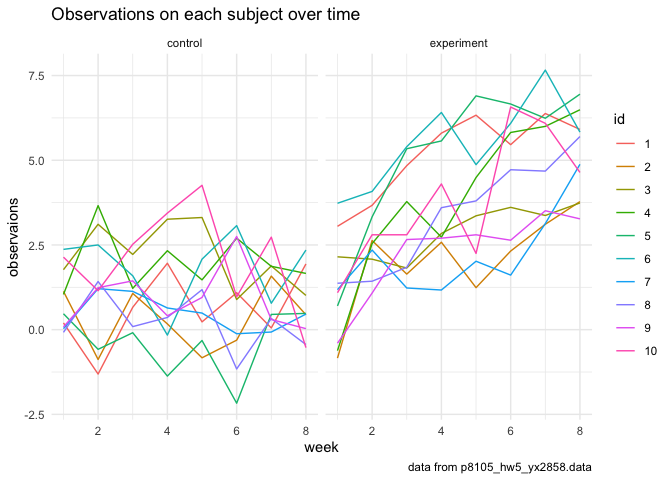
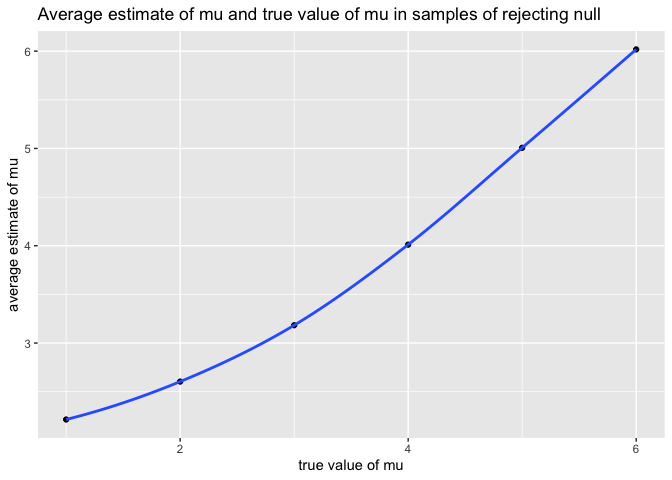

p8105_hw5_yx2858
================
Yueyi Xu
2023-11-12

# Problem 1

### Describe the raw data

``` r
raw_data = read_csv("homicide-data.csv")
```

    ## Rows: 52179 Columns: 12
    ## ── Column specification ────────────────────────────────────────────────────────
    ## Delimiter: ","
    ## chr (9): uid, victim_last, victim_first, victim_race, victim_age, victim_sex...
    ## dbl (3): reported_date, lat, lon
    ## 
    ## ℹ Use `spec()` to retrieve the full column specification for this data.
    ## ℹ Specify the column types or set `show_col_types = FALSE` to quiet this message.

There are 52179 rows and 12 columns in the dataset of homicide.

``` r
homicide = raw_data |>
  mutate(city_state = str_c(city, state, sep = ', '))
```

``` r
homicide |>
  group_by(city) |>
  summarize(count = n()) |>
  knitr::kable(caption = "Total number of homicides")
```

| city           | count |
|:---------------|------:|
| Albuquerque    |   378 |
| Atlanta        |   973 |
| Baltimore      |  2827 |
| Baton Rouge    |   424 |
| Birmingham     |   800 |
| Boston         |   614 |
| Buffalo        |   521 |
| Charlotte      |   687 |
| Chicago        |  5535 |
| Cincinnati     |   694 |
| Columbus       |  1084 |
| Dallas         |  1567 |
| Denver         |   312 |
| Detroit        |  2519 |
| Durham         |   276 |
| Fort Worth     |   549 |
| Fresno         |   487 |
| Houston        |  2942 |
| Indianapolis   |  1322 |
| Jacksonville   |  1168 |
| Kansas City    |  1190 |
| Las Vegas      |  1381 |
| Long Beach     |   378 |
| Los Angeles    |  2257 |
| Louisville     |   576 |
| Memphis        |  1514 |
| Miami          |   744 |
| Milwaukee      |  1115 |
| Minneapolis    |   366 |
| Nashville      |   767 |
| New Orleans    |  1434 |
| New York       |   627 |
| Oakland        |   947 |
| Oklahoma City  |   672 |
| Omaha          |   409 |
| Philadelphia   |  3037 |
| Phoenix        |   914 |
| Pittsburgh     |   631 |
| Richmond       |   429 |
| Sacramento     |   376 |
| San Antonio    |   833 |
| San Bernardino |   275 |
| San Diego      |   461 |
| San Francisco  |   663 |
| Savannah       |   246 |
| St. Louis      |  1677 |
| Stockton       |   444 |
| Tampa          |   208 |
| Tulsa          |   584 |
| Washington     |  1345 |

Total number of homicides

``` r
homicide |>
  group_by(city_state) |>
  summarize(total_homicides = n(),
            unsolved_homicides = sum(disposition == "Closed without arrest") +
                                       sum(disposition == "Open/No arrest")) |>
  arrange(desc(total_homicides)) |>
  knitr::kable(caption = "Total number of unsolved homicides")
```

| city_state         | total_homicides | unsolved_homicides |
|:-------------------|----------------:|-------------------:|
| Chicago, IL        |            5535 |               4073 |
| Philadelphia, PA   |            3037 |               1360 |
| Houston, TX        |            2942 |               1493 |
| Baltimore, MD      |            2827 |               1825 |
| Detroit, MI        |            2519 |               1482 |
| Los Angeles, CA    |            2257 |               1106 |
| St. Louis, MO      |            1677 |                905 |
| Dallas, TX         |            1567 |                754 |
| Memphis, TN        |            1514 |                483 |
| New Orleans, LA    |            1434 |                930 |
| Las Vegas, NV      |            1381 |                572 |
| Washington, DC     |            1345 |                589 |
| Indianapolis, IN   |            1322 |                594 |
| Kansas City, MO    |            1190 |                486 |
| Jacksonville, FL   |            1168 |                597 |
| Milwaukee, wI      |            1115 |                403 |
| Columbus, OH       |            1084 |                575 |
| Atlanta, GA        |             973 |                373 |
| Oakland, CA        |             947 |                508 |
| Phoenix, AZ        |             914 |                504 |
| San Antonio, TX    |             833 |                357 |
| Birmingham, AL     |             800 |                347 |
| Nashville, TN      |             767 |                278 |
| Miami, FL          |             744 |                450 |
| Cincinnati, OH     |             694 |                309 |
| Charlotte, NC      |             687 |                206 |
| Oklahoma City, OK  |             672 |                326 |
| San Francisco, CA  |             663 |                336 |
| Pittsburgh, PA     |             631 |                337 |
| New York, NY       |             627 |                243 |
| Boston, MA         |             614 |                310 |
| Tulsa, OK          |             583 |                193 |
| Louisville, KY     |             576 |                261 |
| Fort Worth, TX     |             549 |                255 |
| Buffalo, NY        |             521 |                319 |
| Fresno, CA         |             487 |                169 |
| San Diego, CA      |             461 |                175 |
| Stockton, CA       |             444 |                266 |
| Richmond, VA       |             429 |                113 |
| Baton Rouge, LA    |             424 |                196 |
| Omaha, NE          |             409 |                169 |
| Albuquerque, NM    |             378 |                146 |
| Long Beach, CA     |             378 |                156 |
| Sacramento, CA     |             376 |                139 |
| Minneapolis, MN    |             366 |                187 |
| Denver, CO         |             312 |                169 |
| Durham, NC         |             276 |                101 |
| San Bernardino, CA |             275 |                170 |
| Savannah, GA       |             246 |                115 |
| Tampa, FL          |             208 |                 95 |
| Tulsa, AL          |               1 |                  0 |

Total number of unsolved homicides

From the table, Chicago has the highest number of homicides of 5535 and
highest number of unsolved homicides of 4073. Tulsa, AL has the lowest
number of homicides of 1 and lowest number of unsolved homicides of 0.

### Proportion test in Baltimore

``` r
baltimore = homicide |>
  filter(city_state == "Baltimore, MD") |>
  mutate(unsolved_homicides = ifelse(disposition == "Open/No arrest" | disposition == "Closed without arrest", 1, 0))
```

``` r
result_baltimore = 
  prop.test(sum(baltimore$unsolved_homicides), length(baltimore$unsolved_homicides)) |>
  broom::tidy()
result_baltimore
```

    ## # A tibble: 1 × 8
    ##   estimate statistic  p.value parameter conf.low conf.high method    alternative
    ##      <dbl>     <dbl>    <dbl>     <int>    <dbl>     <dbl> <chr>     <chr>      
    ## 1    0.646      239. 6.46e-54         1    0.628     0.663 1-sample… two.sided

``` r
save(result_baltimore, file = "result/result_baltimore.RData")
```

The proportion test on Baltimore estimates that 0.6455607 of the
homicides are unsolved, and 95% confidence interval for the proportion
estimate is 0.6275625 to 0.6631599.

# Problem 2

### Start with a dataframe containing all file names

``` r
full_df = 
  tibble( #create a tibble with a column named files, containing the full file paths of the files in the "data" directory
    files = list.files("data", full.names = TRUE)
  )|>
  mutate(data = map(files, read.csv)) #add a new column "data" using the map function, for each file in the files column, the read.csv function is applied, which reads the CSV file and stores the result in the data column
```

### Iterate over file names and read in data for each subject, tidy the result; manipulate file names to include control arm and subject ID

``` r
tidy_df =
  full_df |>
  mutate(
    participant = map(files, read_csv),  #add a new column named participant by applying read_csv to each file in the files column which assumes that the files are in csv format
    arm = case_when(str_detect(files, "exp") ~ "experiment", #add a new column named arm and categorize exp and con according to experiment and control
                    str_detect(files, "con") ~ "control"), 
    id = as.factor(parse_number(files)) #add a new column named id and extract number from the files and convert it
  ) |>
  unnest(participant) |> #unnest the participant column
  pivot_longer( #reshape the data to horizontal view, changing columns from week 1 to week 8 to week and observations
    week_1:week_8,
    names_to = "week",
    values_to = "observations",
    names_prefix = "week_") |>
  mutate(week = as.numeric(week)) |> #convert week to numeric
  select(arm, id, week, observations) #select the specific columns to generate the finalized tidy_df
```

### Spaghetti plot

``` r
tidy_df |>
  ggplot(aes(x = week, y = observations, group = id, color = id)) + #set up the ggplot and specify x axis as week and y axis as observations
  geom_line() + #add line
  facet_grid(. ~ arm) + #create two panels based on the arm category
  labs( #set the plot's title, x axis label, y axis label, and caption
    title = "Observations on each subject over time",
    x = "week",
    y = "observaions",
    caption = "data from p8105_hw5_yx2858.data"
  ) +
  theme_minimal()
```

<!-- -->

Comment on the plots: In the control group, participant’s observations
generally stay between -2.5 to 5.0 and fluctuate from weeks to weeks
with no specific pattern. However, in the experiment group,
participant’s observations increase from week 1 to week 8, indicating a
linear trend since week 1.

# Problem 3

### Define the function of t test

``` r
sim_norm =
  function(n=30, mu, sd=5){
    x = rnorm(n, mean=mu, sd) #generate random sample from normal distribution
    test_result = t.test(x) |> #perform a t test
      broom::tidy() |>
      select(estimate, p.value) #select the estimate and p.value
  }
```

### Set $\mu$=0 and generate 5000 data

``` r
sim_mu0 = rerun(5000, sim_norm(mu=0)) |> #run 5000 cases of normal distribution with mu=0
  bind_rows() #combine into a single dataframe
```

    ## Warning: `rerun()` was deprecated in purrr 1.0.0.
    ## ℹ Please use `map()` instead.
    ##   # Previously
    ##   rerun(5000, sim_norm(mu = 0))
    ## 
    ##   # Now
    ##   map(1:5000, ~ sim_norm(mu = 0))
    ## This warning is displayed once every 8 hours.
    ## Call `lifecycle::last_lifecycle_warnings()` to see where this warning was
    ## generated.

### Repeat for $\mu$ = {1, 2, 3, 4, 5, 6}

``` r
sim_mu123456 = 
  tibble( #create a tibble with a column named mu with values 1 to 6
    mu = c(1, 2, 3, 4, 5, 6)
  ) |>
  mutate(outputs = map(.x = mu, ~ rerun(5000, sim_norm(n=30, mu = .x, sd=5))), #for each mu, simulate 5000 cases of normal distributions
         result = map(outputs, bind_rows)) |> #add the column named result which contain all the outputs of all the values
  unnest(result) |> #unnest the result column
  select(-outputs) #remove the outputs column
```

    ## Warning: There was 1 warning in `mutate()`.
    ## ℹ In argument: `outputs = map(.x = mu, ~rerun(5000, sim_norm(n = 30, mu = .x,
    ##   sd = 5)))`.
    ## Caused by warning:
    ## ! `rerun()` was deprecated in purrr 1.0.0.
    ## ℹ Please use `map()` instead.
    ##   # Previously
    ##   rerun(5000, sim_norm(n = 30, mu = .x, sd = 5))
    ## 
    ##   # Now
    ##   map(1:5000, ~ sim_norm(n = 30, mu = .x, sd = 5))

### Make a plot showing the proportion of times the null was rejected (the power of the test) on the y axis and the true value of $\mu$ on the x axis

``` r
sim_mu123456 |>
  group_by(mu) |> #group the data by the true value of mu
  summarize(p_value = sum(p.value < 0.05), #calculate the total number of times the null was rejected
            n = n(),
            prop_reject = p_value / n) |>
  ggplot(aes(x = mu, y = prop_reject)) + #set up the ggplot and specify x axis with true value of mu and y axis as proportion of rejection
  geom_point() + #add points to plot
  geom_smooth() + #add a smooth line to plot
  labs( #set the plot's title, x axis label, and y axis label
    title = "Proportion of times the null was rejected",
    x = "true value of mu",
    y = "power of the test"
  )
```

    ## `geom_smooth()` using method = 'loess' and formula = 'y ~ x'

    ## Warning in max(ids, na.rm = TRUE): no non-missing arguments to max; returning
    ## -Inf

<!-- -->

Comment on the plot: The proportion of times the null was rejected
increases as mu increases from 1 to 6. Therefore, there is a positive
linear correlation between the power of the test and the true value of
$\mu$. The power of the test increases as the size increases and
approaches 1 ultimately.

### Make a plot showing the the average estimate of $\hat{\mu}$ on the y axis and the true value of $\mu$ on the x axis

``` r
sim_mu123456 |>
  group_by(mu) |> #group the data by the true value of mu
  summarize(avg = mean(estimate, na.rm = TRUE)) |> #calculate the average estimate of mu for each true value of mu
  ggplot(aes(x = mu, y = avg)) + #set up the ggplot and specify x axis with true value of mu and y axis as average estimate of mu
  geom_point() + #add points to the plot
  geom_smooth() + #add a smooth line to the plot
  labs( #set the plot's title, x axis label, and y axis label
    title = "Average estimate of mu and true value of mu",
    x = "true value of mu",
    y = "average estimate of mu"
  )
```

    ## `geom_smooth()` using method = 'loess' and formula = 'y ~ x'

    ## Warning in max(ids, na.rm = TRUE): no non-missing arguments to max; returning
    ## -Inf

<!-- -->

### Make a second plot (or overlay on the first) the average estimate of $\hat{\mu}$ only in samples for which the null was rejected on the y axis and the true value of $\mu$ on the x axis

``` r
sim_mu123456 |>
  group_by(mu) |> #group the data by the true value of mean
  filter(p.value < 0.05) |> #filter the data to include only cases where the null hypothesis was rejected (p.value < 0.05)
  summarize(avg = mean(estimate, na.rm = TRUE)) |> #calculate the average estimate of mu for each true value of mu
  ggplot(aes(x = mu, y = avg)) + #set up the ggplot and specify x axis with true value of mu and y axis as average estimate of mu
  geom_point() + #add points to the plot
  geom_smooth() + #add a smooth line to the plot
  labs( #set the plot's title, x axis label, and y axis label
    title = "Average estimate of mu and true value of mu in samples of rejecting null",
    x = "true value of mu",
    y = "average estimate of mu"
  )
```

    ## `geom_smooth()` using method = 'loess' and formula = 'y ~ x'

    ## Warning in max(ids, na.rm = TRUE): no non-missing arguments to max; returning
    ## -Inf

<!-- -->

Comment on the above plot: The sample average of $\hat{\mu}$ across
tests for which the null is rejected is approximately equal to the true
value of $\mu$. When the true value of $\mu$ is below 4, the average
estimate of $\hat{\mu}$ is slightly higher than the true value of $\mu$.
This is due to the smaller the effect size and the lower the power of
the test. When the true value of $\mu$ is equal and larger than 4, the
average estimate of $\hat{\mu}$ is approximately equal to the true value
of $\mu$. In this case, the larger the effect size and the higher the
power of the test.
